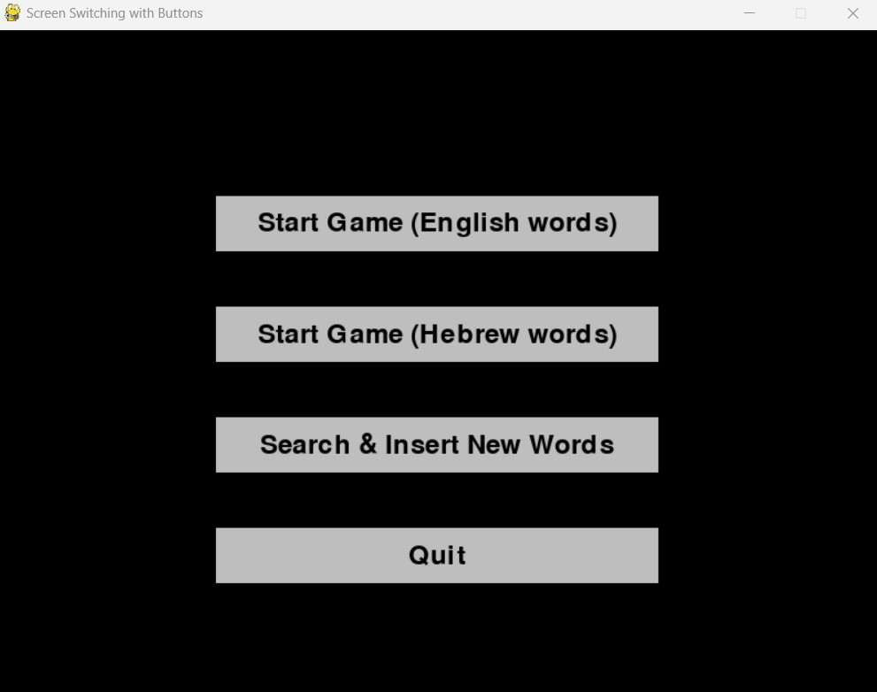
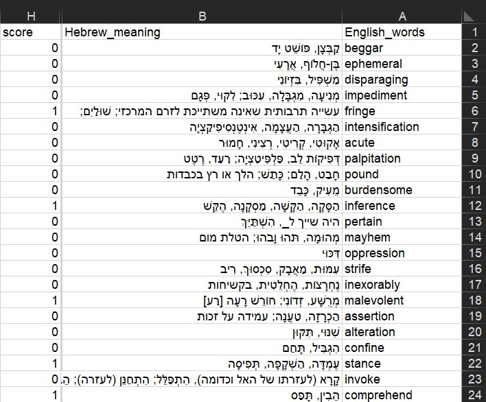
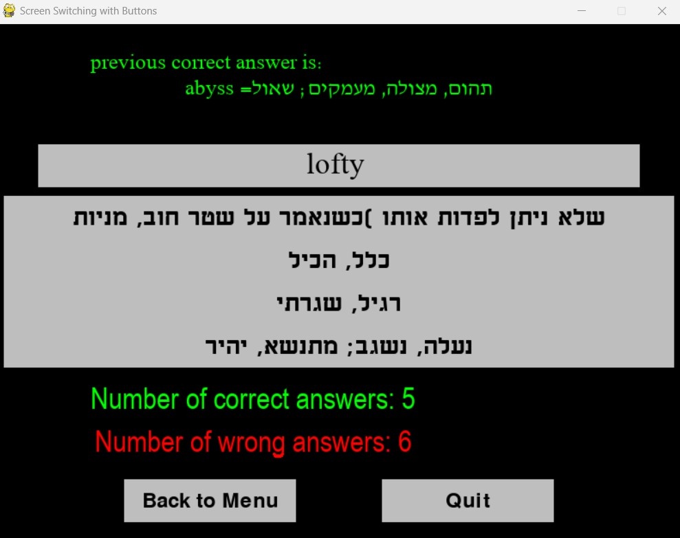
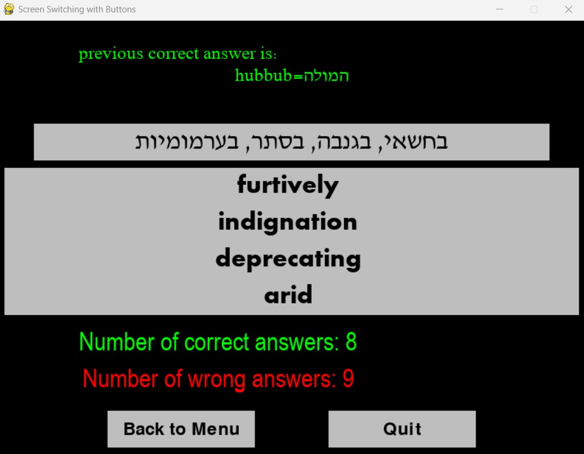

# English Hebrew Game

<!-- PROJECT LOGO -->
 

  <h3 align="center">A simple game for learning new english words</h3>

---

  

 
 
    Short Readme with guidelines, examples and more
     

<!-- HOW TO PLAY -->
## How to play

---

First you need to have an csv file in the following columns:

1. English_words
2. Hebrew_meaning
3. score

you can see an example below:

Then you can run the main (from the IDE or from the commend line by: "get\to\file\location python main.py)

Now when the game has started and you get to the main screen (the first picture) you can navigate between the screens:

## Search & Save new words
 
 
    Here you type a word for search (only in english),
    by typing ENTER you get the Hebrew meaning.
    Then you can search a new word but if you want to add it to the csv file
    you should first press the 'save word' button.
     

## The game

By clicking the words you can see the previous correct answer on the top and get the next question.